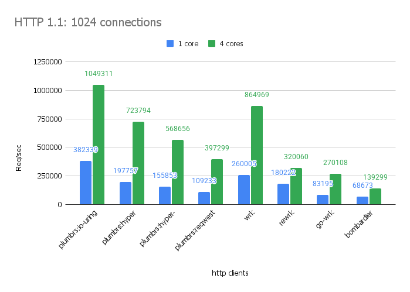
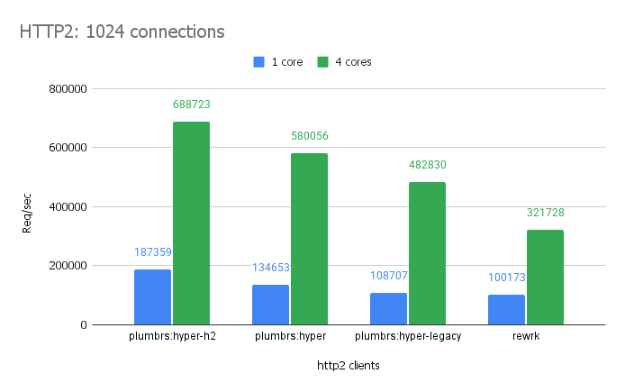

# Plumbrs — HTTP/HTTP2 load generator for benchmarking

Plumbrs is a high-performance HTTP/HTTP2 request generator designed for benchmarking servers and comparing Rust HTTP client libraries. Built on Tokio, it helps you measure throughput, latency, and identify bottlenecks.

## Built-in clients

- **Auto** (`auto`) — Automatically select the best client (default).
- **Hyper** (`hyper`) — Hyper-based HTTP client (one per connection).
- **Hyper multichunk** (`hyper-multichunk`) — Hyper client with multi-chunked body (one per connection).
- **Hyper legacy** (`hyper-legacy`) — Legacy Hyper HTTP client (one per connection).
- **Hyper RT1** (`hyper-rt1`) — Legacy Hyper HTTP client shared across a runtime.
- **Hyper H2** (`hyper-h2`) — HTTP/2 client using Hyper with the h2 library (one per connection).
- **Reqwest** (`reqwest`) — Popular Reqwest HTTP client (one per runtime).
- **IoUring** (`io-uring`) — HTTP client using io_uring for high-performance I/O (Linux only).
- **Help** (`help`) — Print available client types and exit.

## Basic options

- `<URI>` — HTTP URI(s) for the request (e.g., `http://192.168.0.1:80`). Required for most clients.

- `-t, --threads <NUMBER>` (default: `1`) — Number of worker threads.

- `-m, --multi-threaded <NUMBER>` — Threads per Tokio runtime. If omitted, uses single-threaded executor. When specified, `--threads` must be an exact multiple of this value.

- `-c, --concurrency <NUMBER>` (default: `1`) — Concurrent connections or HTTP/2 streams.

- `-d, --duration <SECONDS>` — Test duration in seconds.

- `-r, --requests <NUMBER>` — Maximum requests per worker. If omitted, runs until duration elapses.

- `-C, --client <TYPE>` (default: `auto`) — Client type: `auto`, `hyper`, `hyper-multichunk`, `hyper-h2`, `hyper-legacy`, `hyper-rt1`, `reqwest`, `io-uring`, or `help`.

- `--cps` — Open a new connection for every request, measuring Connections Per Second.

- `--latency` — Enable latency estimation using Gil Tene's coordinated omission correction algorithm.

- `--sse` — Enable Server-Sent Events (SSE) handshake. Only available with `auto` or `hyper` client.

- `--host <HOST>` — Override the host to connect to. Not available with `hyper-legacy` or `hyper-rt1`.

- `--port <PORT>` — Override the port to connect to.

- `-v, --verbose` — Enable verbose output.

- `--metrics` — Display Tokio runtime metrics at the end.

## HTTP options

- `-M, --method <METHOD>` — HTTP method (e.g., `GET`, `POST`, `PUT`, `DELETE`). If omitted, defaults to `GET` when no body is provided, or `POST` when a body is specified. Note: `TRACE` method cannot have a body.

- `-H, --header <KEY:VALUE>` — Add HTTP header (repeatable).

- `-T, --trailer <KEY:VALUE>` — Add HTTP trailer (repeatable). Not available with `reqwest` client.

- `-B, --body <BODY>` — Request body content. Can be specified multiple times for multi-chunk encoding, but multi-chunk is only supported with `hyper-multichunk` client.

- `-b, --body-from-file <PATH>` — File path for request body (streamed).

- `--http2` — Use HTTP/2 only. Not available with `io-uring` client.

## HTTP/1 tuning options

- `--http1-max-buf-size <NUMBER>` — Maximum buffer size (default: ~400kb).
- `--http1-read-buf-exact-size <NUMBER>` — Exact read buffer size (unsets max-buf-size).
- `--http1-writev <true|false>` — Use vectored writes (default: auto).
- `--http1-title-case-headers` — Write header names as title case.
- `--http1-preserve-header-case` — Preserve original header case. Not available with `hyper-legacy` or `hyper-rt1`.
- `--http1-max-headers <NUMBER>` — Maximum number of headers (default: 100).
- `--http1-allow-spaces-after-header-name-in-responses` — Accept spaces after header names.
- `--http1-allow-obsolete-multiline-headers-in-responses` — Accept obsolete line folding.
- `--http1-ignore-invalid-headers-in-responses` — Silently ignore malformed headers.
- `--http09-responses` — Tolerate HTTP/0.9 responses.

## HTTP/2 tuning options

- `--http2-adaptive-window <true|false>` — Enable adaptive flow control. Not available with `hyper-h2`.
- `--http2-initial-max-send-streams <NUMBER>` — Initial max locally initiated streams. Not available with `reqwest`.
- `--http2-max-concurrent-reset-streams <NUMBER>` — Max concurrently reset streams. Not available with `reqwest`.
- `--http2-initial-stream-window-size <NUMBER>` — Initial stream-level flow control window.
- `--http2-initial-connection-window-size <NUMBER>` — Initial connection-level flow control window.
- `--http2-max-frame-size <NUMBER>` — Maximum frame size.
- `--http2-max-header-list-size <NUMBER>` — Maximum header list size.
- `--http2-max-send-buffer-size <NUMBER>` — Maximum send buffer size. Not available with `reqwest`.
- `--http2-keep-alive-while-idle` — Enable keep-alive while idle. Not available with `hyper-h2`.

## Tokio runtime options

- `--global-queue-interval <TICKS>` — Global queue interval.
- `--event-interval <TICKS>` — Event interval.
- `--max-io-events-per-tick <NUMBER>` — Maximum I/O events per tick.
- `--disable-lifo-slot` — Disable LIFO slot heuristic (requires `tokio_unstable`).

## io_uring options (Linux only)

The `io-uring` client supports HTTP/1 only and does not support multi-threaded runtimes (`-m`).

- `--uring-entries <NUMBER>` (default: `4096`) — Size of the io_uring Submission Queue.
- `--uring-sqpoll <MILLISECONDS>` — Enable kernel-side submission polling with idle timeout.

## Examples

Basic GET request with 10 concurrent connections for 30 seconds:
```plumbrs/README.md#L1
plumbrs -c 10 -d 30 http://localhost:8080
```

POST request with headers and body:
```plumbrs/README.md#L1
plumbrs -t 4 -c 100 -M POST \
  -H "Content-Type:application/json" \
  -B '{"key":"value"}' http://localhost:8080/api
```

POST with body from file:
```plumbrs/README.md#L1
plumbrs -M POST -b ./payload.json http://localhost:8080/api
```

HTTP/2 with flow control tuning:
```plumbrs/README.md#L1
plumbrs -C hyper --http2 \
  --http2-initial-stream-window-size 1048576 \
  --http2-initial-connection-window-size 2097152 \
  -c 100 -d 30 http://localhost:8080
```

Connections Per Second test:
```plumbrs/README.md#L1
plumbrs -C hyper --cps -c 10 -r 1000 http://localhost:8080
```

Latency-corrected benchmarking:
```plumbrs/README.md#L1
plumbrs --latency -c 100 -d 30 http://localhost:8080
```

## Performance

### HTTP/1.1



The `io-uring` client delivers **382K RPS on a single thread** and scales to **1.05M RPS with 4 threads**. The `hyper` client also performs exceptionally (198K → 724K RPS), surpassing `wrk`. The `reqwest` client maintains competitive throughput (109K → 397K RPS).

### HTTP/2



The `hyper-h2` client achieves **187K RPS on a single thread** and **689K RPS with 4 threads**. The standard `hyper` client with HTTP/2 follows closely (135K → 580K RPS). All Plumbrs HTTP/2 clients outperform `rewrk` in this benchmark.

## Enabling Tokio unstable APIs

Some options require Tokio's unstable APIs:
```plumbrs/README.md#L1
RUSTFLAGS="--cfg tokio_unstable" cargo build --release
```
